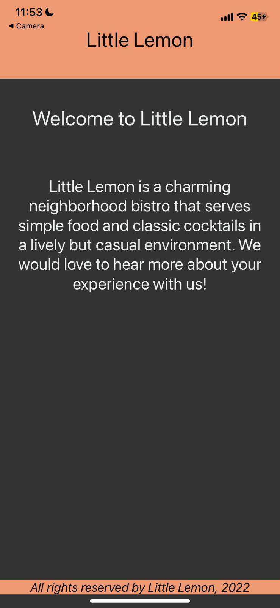

# FlatList Starter Code 
## Exercise: Render a large list using FlatList
### Tecnologias:
Expo 
React Native
### Sobre o exercício:
"By now, you should be familiar with the FlatList component and how to use it to render large lists. Recall that FlatList renders items lazily, which means that it only renders items as they're needed rather than the entire list. This makes it ideal for rendering large lists without slowing down app performance.

In this exercise, you will update the Little Lemon app to display a large list of menu items and each item’s price. You will accomplish this by using a FlatList component."

Como deve ficar:


Como está no starter code:


## Relatos
A versão do SDK estava desatualizada, precisei realizar o seguinte comando: 
```
expo upgrade 47
``` 
